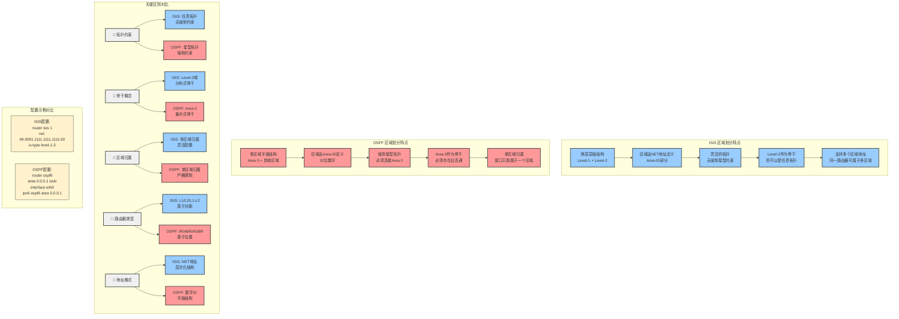
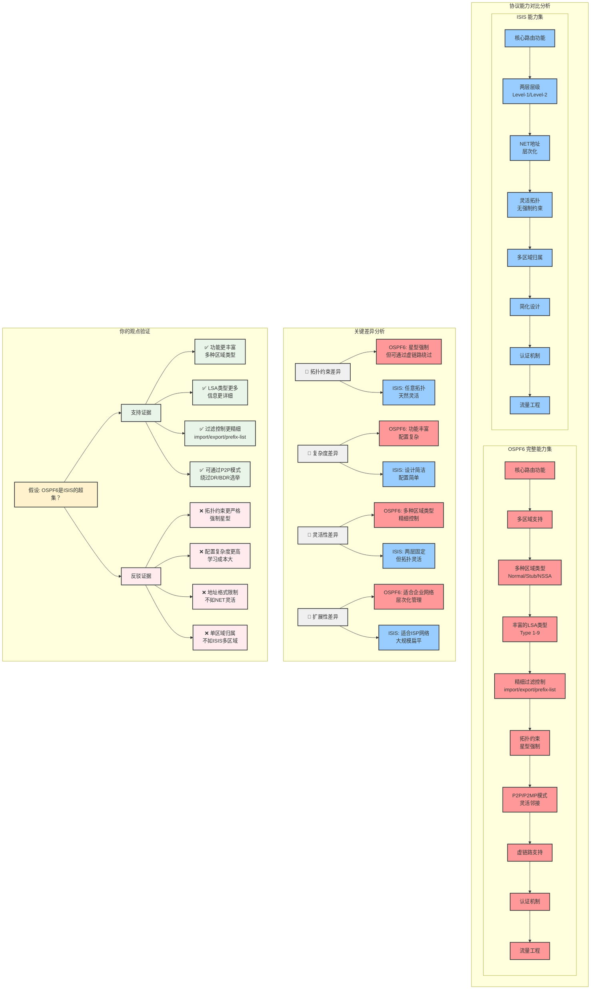

让我搜索FRR中ISIS的区域划分实现来了解其拓扑约束：

让我继续搜索ISIS的层级结构和区域约束：

现在让我搜索更多关于ISIS层级和NET地址格式的信息：

基于对FRR中ISIS实现的分析，让我用图表详细解释ISIS的区域划分机制：

现在让我画一个ISIS与OSPF区域划分对比图：

最后让我画一个ISIS路由信息传播的详细流程图：

## ISIS 区域划分机制总结

基于对FRR中ISIS实现的分析，ISIS的区域划分机制与OSPF有显著不同：

### 1. **区域定义方式**

````c path=isisd/isisd.c mode=EXCERPT
addr->addr_len -= (ISIS_SYS_ID_LEN + ISIS_NSEL_LEN);
listnode_add(area->area_addrs, addr);
````

- **NET地址格式**: `AFI.Area-ID.System-ID.NSEL`
- **区域由Area-ID部分定义**: 如49.0001表示区域1
- **支持多个区域地址**: 同一路由器可属于多个区域

### 2. **层级结构**

````c path=isisd/isisd.c mode=EXCERPT
if (area->is_type & IS_LEVEL_1)
    lsp_generate(area, IS_LEVEL_1);
if (area->is_type & IS_LEVEL_2)
    lsp_generate(area, IS_LEVEL_2);
````

- **两层结构**: Level-1 (区域内) + Level-2 (区域间)
- **路由器类型**:
  - Level-1: 只在本区域内路由
  - Level-2: 只在Level-2域内路由  
  - Level-1-2: 连接两个层级的边界路由器

### 3. **拓扑约束**

**ISIS的优势 - 灵活性**:
- ✅ **无强制星型拓扑**: Level-2域可以是任意连通图
- ✅ **灵活的区域连接**: 通过L1-L2路由器连接
- ✅ **多区域归属**: 路由器可配置多个NET地址
- ✅ **分布式骨干**: Level-2域分布在整个网络中

**ISIS的约束**:
- ❌ **两层限制**: 只支持两层层级结构
- ❌ **System-ID唯一性**: 同一区域内System-ID必须唯一
- ❌ **地址格式固定**: 必须遵循NET地址格式

### 4. **与OSPF的核心区别**

| 特性 | ISIS | OSPF |
|------|------|------|
| **拓扑约束** | 无强制约束，任意拓扑 | 强制星型，必须连接Area 0 |
| **骨干概念** | Level-2域，分布式 | Area 0，集中式 |
| **区域归属** | 多区域归属 | 单区域归属 |
| **层级结构** | 两层固定 | 多区域平面 |
| **地址格式** | NET地址，层次化 | 数字ID，平面化 |

### 5. **配置示例**

```` path=tests/topotests/isis_srv6_topo1/rt2/isisd.conf mode=EXCERPT
router isis 1
 net 49.0000.0000.0000.0002.00
 is-type level-1
````

### 6. **路由传播机制**

- **Level-1**: 区域内详细路由信息
- **Level-2**: 区域间汇总路由信息  
- **L1-L2路由器**: 
  - 向上泄露: L1路由汇总到L2
  - 向下泄露: L2默认路由到L1
  - 设置ATT位指示外部连通性

### 总结

ISIS的区域划分设计更加灵活，没有OSPF那样严格的拓扑约束。这使得ISIS特别适合：

1. **大型ISP网络**: 需要灵活拓扑的场景
2. **数据中心网络**: Spine-Leaf架构
3. **复杂企业网络**: 不规则拓扑结构

ISIS的两层设计简化了网络层级，同时保持了良好的扩展性，这是其在大型网络中广泛应用的重要原因。




