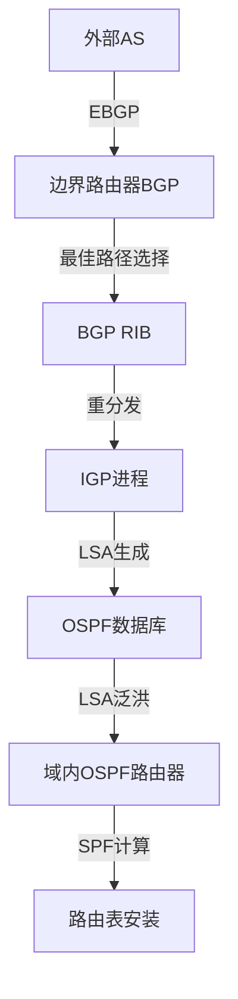

对于只运行IGP协议而没有运行BGP的路由器，它们感知外部路由主要通过以下几种机制：

## 1. BGP到IGP的路由重分发

### 1.1 重分发机制

基于我对FRR代码的深入分析，现在我来详细解释只运行IGP协议的路由器如何感知外部路由：

# 非BGP路由器感知外部路由的机制

## 1. 路由重分发机制 (Route Redistribution)

### 1.1 BGP到IGP的重分发

只运行IGP的路由器主要通过**路由重分发**机制感知外部路由。运行BGP的边界路由器将BGP学到的外部路由重分发到IGP中。

````c path=ospfd/ospf_zebra.c mode=EXCERPT
int ospf_redistribute_set(struct ospf *ospf, struct ospf_redist *red, int type,
			  unsigned short instance, int mtype, int mvalue)
{
	red->dmetric.type = mtype;
	red->dmetric.value = mvalue;

	ospf_external_add(ospf, type, instance);

	zclient_redistribute(ZEBRA_REDISTRIBUTE_ADD, zclient, AFI_IP, type,
			     instance, ospf->vrf_id);
````

### 1.2 重分发流程



## 2. OSPF外部LSA机制

### 2.1 外部LSA生成

````c path=ospfd/ospf_lsa.c mode=EXCERPT
/* Originate an AS-external-LSA, install and flood. */
struct ospf_lsa *ospf_external_lsa_originate(struct ospf *ospf,
					     struct external_info *ei)
{
	struct ospf_lsa *new;

	if (ospf->gr_info.restart_in_progress) {
		if (IS_DEBUG_OSPF(lsa, LSA_GENERATE))
			zlog_debug(
				"LSA[Type5]: Graceful Restart in progress, don't originate");
		return NULL;
	}
````

**OSPF外部LSA类型：**
- **Type-5 LSA**：AS外部LSA，在整个AS内泛洪
- **Type-7 LSA**：NSSA外部LSA，仅在NSSA区域内泛洪

### 2.2 外部LSA结构

````c path=ospfd/ospf_lsa.h mode=EXCERPT
/* OSPF AS-external-LSAs structure. */
struct as_external_lsa {
	struct lsa_header header;
	struct in_addr mask;
	struct as_route {
		uint8_t tos;
		uint8_t metric[3];
		struct in_addr fwd_addr;
		uint32_t route_tag;
	} e[1];
};
````

## 3. 具体实现机制

### 3.1 OSPF重分发配置

```bash
# 在边界路由器上配置
router ospf
 # 重分发BGP路由到OSPF
 redistribute bgp metric 100 metric-type 2
 
 # 重分发静态路由
 redistribute static metric 50 metric-type 1
 
 # 生成默认路由
 default-information originate always metric 10
```

### 3.2 RIP重分发配置

````c path=ripd/rip_zebra.c mode=EXCERPT
/* Then fetch IPv4 prefixes. */
if (cmd == ZEBRA_REDISTRIBUTE_ROUTE_ADD)
	rip_redistribute_add(rip, api.type, RIP_ROUTE_REDISTRIBUTE,
			     (struct prefix_ipv4 *)&api.prefix, &nh,
			     api.metric, api.distance, api.tag);
else if (cmd == ZEBRA_REDISTRIBUTE_ROUTE_DEL)
	rip_redistribute_delete(rip, api.type, RIP_ROUTE_REDISTRIBUTE,
				(struct prefix_ipv4 *)&api.prefix,
				nh.ifindex);
````

```bash
# RIP重分发配置
router rip
 # 重分发BGP路由
 redistribute bgp metric 5
 
 # 重分发OSPF路由
 redistribute ospf metric 3
```

### 3.3 ISIS重分发配置

````c path=isisd/isis_redist.c mode=EXCERPT
void isis_redist_set(struct isis_area *area, int level, int family, int type,
		     uint32_t metric, const char *routemap, int originate_type,
		     uint16_t table)
{
	int protocol = redist_protocol(family);
	struct isis_redist *redist = isis_redist_get(area, family, type, level,
						     table);
````

```bash
# ISIS重分发配置
router isis
 # 重分发BGP路由
 redistribute ipv4 bgp level-2 metric 100
```

## 4. 默认路由传播

### 4.1 OSPF默认路由生成

````c path=ospfd/ospf_zebra.c mode=EXCERPT
/* If this is add route and permit then ooriginate default. */
if (cmd == ZEBRA_REDISTRIBUTE_ROUTE_ADD) {
	/* If permit and default already advertise then return. */
	if (lsa && !IS_LSA_MAXAGE(lsa)) {
		if (IS_DEBUG_OSPF_DEFAULT_INFO)
			zlog_debug("Default lsa already originated(%s)",
				   ospf_vrf_id_to_name(ospf->vrf_id));
		return true;
	}

	if (IS_DEBUG_OSPF_DEFAULT_INFO)
		zlog_debug("Originating/Refreshing default lsa(%s)",
			   ospf_vrf_id_to_name(ospf->vrf_id));
````

**默认路由传播方式：**
1. **条件生成**：只有当存在外部路由时才生成
2. **强制生成**：使用`always`参数强制生成
3. **路由映射**：通过route-map控制默认路由属性

## 5. 路由过滤和控制

### 5.1 Route-Map过滤

```bash
# 创建route-map过滤重分发路由
route-map BGP-TO-OSPF permit 10
 match ip address prefix-list EXTERNAL-ROUTES
 set metric 200
 set metric-type 2

route-map BGP-TO-OSPF deny 20

# 应用到重分发
router ospf
 redistribute bgp route-map BGP-TO-OSPF
```

### 5.2 管理距离控制

```bash
router ospf
 # 设置外部路由的管理距离
 distance ospf external 110
 distance ospf inter-area 110
 distance ospf intra-area 110
```

## 6. 不同IGP协议的特点

### 6.1 OSPF特点

| 特性 | 描述 | 优势 |
|------|------|------|
| **外部LSA** | Type-5/Type-7 LSA | 详细的外部路由信息 |
| **区域控制** | 可控制外部路由传播范围 | 减少LSA泛洪 |
| **度量类型** | Type-1/Type-2度量 | 灵活的路径选择 |
| **NSSA支持** | 支持NSSA区域 | 部分存根区域的外部路由 |

### 6.2 RIP特点

| 特性 | 描述 | 限制 |
|------|------|------|
| **简单重分发** | 直接度量重分发 | 度量值限制(1-16) |
| **水平分割** | 防止路由环路 | 可能影响收敛 |
| **定期更新** | 30秒更新周期 | 收敛较慢 |

### 6.3 ISIS特点

| 特性 | 描述 | 优势 |
|------|------|------|
| **层次结构** | Level-1/Level-2 | 可控制重分发层次 |
| **TLV扩展** | 灵活的信息携带 | 支持多种路由信息 |
| **快速收敛** | 增量SPF | 较快的收敛速度 |

## 7. 配置示例

### 7.1 完整的边界路由器配置

```bash
# BGP配置
router bgp 65001
 bgp router-id 10.0.0.1
 neighbor 192.168.1.1 remote-as 65002
 
 address-family ipv4 unicast
  neighbor 192.168.1.1 activate
  network 10.0.0.0/8
 exit-address-family

# OSPF配置
router ospf
 ospf router-id 10.0.0.1
 network 10.0.0.0 0.255.255.255 area 0
 
 # 重分发BGP路由
 redistribute bgp metric 100 metric-type 2
 
 # 生成默认路由
 default-information originate always metric 10
 
 # 重分发静态路由
 redistribute static metric 50 metric-type 1

# 静态路由作为备份
ip route 0.0.0.0 0.0.0.0 192.168.1.1 200
```

### 7.2 纯IGP路由器配置

```bash
# 只运行OSPF的内部路由器
router ospf
 ospf router-id 10.0.0.2
 network 10.0.0.0 0.255.255.255 area 0
 
 # 不需要重分发配置
 # 自动接收外部LSA并计算路径
```

## 8. 收敛优化

### 8.1 快速收敛配置

```bash
# OSPF快速收敛
router ospf
 timers throttle spf 50 100 5000
 timers throttle lsa 50 100 5000
 
# RIP快速收敛
router rip
 timers basic 5 15 15
```

### 8.2 路由汇总

```bash
# OSPF区域汇总
router ospf
 area 1 range 192.168.0.0 255.255.0.0
 
# 外部路由汇总
summary-address 172.16.0.0 255.240.0.0
```

通过这些机制，只运行IGP协议的路由器能够有效地感知和使用外部路由信息，实现整个网络的连通性。关键是在边界路由器上正确配置路由重分发，并根据网络规模和需求选择合适的过滤和控制策略。
