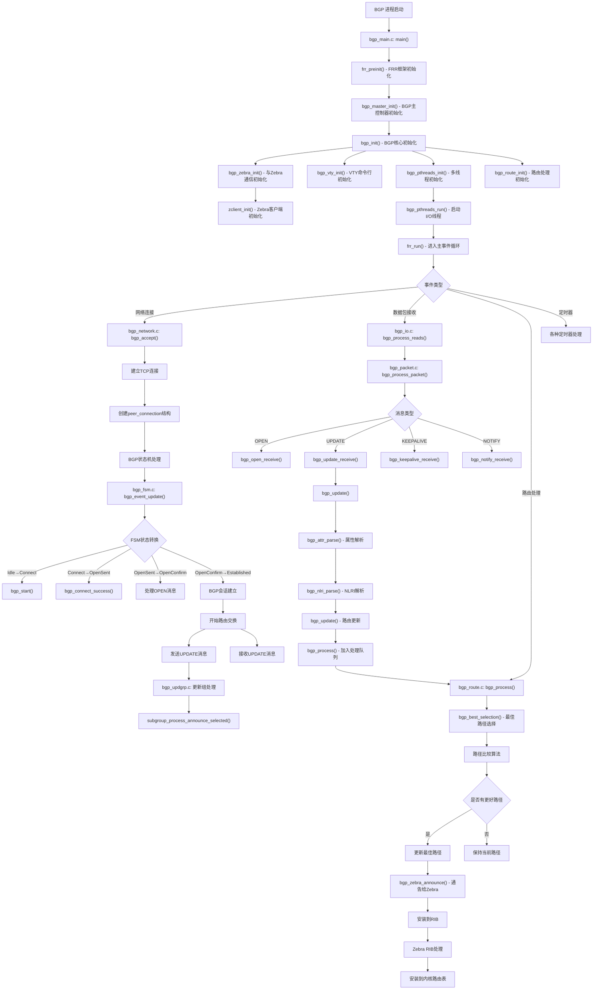

```mermaid
graph TD
    A["BGP 进程启动"] --> B["bgp_main.c: main()"]
    B --> C["frr_preinit() - FRR框架初始化"]
    C --> D["bgp_master_init() - BGP主控制器初始化"]
    D --> E["bgp_init() - BGP核心初始化"]
    
    E --> F["bgp_zebra_init() - 与Zebra通信初始化"]
    E --> G["bgp_vty_init() - VTY命令行初始化"]
    E --> H["bgp_pthreads_init() - 多线程初始化"]
    E --> I["bgp_route_init() - 路由处理初始化"]
    
    F --> J["zclient_init() - Zebra客户端初始化"]
    H --> K["bgp_pthreads_run() - 启动I/O线程"]
    
    K --> L["frr_run() - 进入主事件循环"]
    
    L --> M{"事件类型"}
    
    M -->|网络连接| N["bgp_network.c: bgp_accept()"]
    M -->|数据包接收| O["bgp_io.c: bgp_process_reads()"]
    M -->|路由处理| P["bgp_route.c: bgp_process()"]
    M -->|定时器| Q["各种定时器处理"]
    
    N --> R["建立TCP连接"]
    R --> S["创建peer_connection结构"]
    S --> T["BGP状态机处理"]
    
    O --> U["bgp_packet.c: bgp_process_packet()"]
    U --> V{"消息类型"}
    V -->|OPEN| W["bgp_open_receive()"]
    V -->|UPDATE| X["bgp_update_receive()"]
    V -->|KEEPALIVE| Y["bgp_keepalive_receive()"]
    V -->|NOTIFY| Z["bgp_notify_receive()"]
    
    T --> AA["bgp_fsm.c: bgp_event_update()"]
    AA --> BB{"FSM状态转换"}
    BB -->|Idle→Connect| CC["bgp_start()"]
    BB -->|Connect→OpenSent| DD["bgp_connect_success()"]
    BB -->|OpenSent→OpenConfirm| EE["处理OPEN消息"]
    BB -->|OpenConfirm→Established| FF["BGP会话建立"]
    
    X --> GG["bgp_update()"]
    GG --> HH["bgp_attr_parse() - 属性解析"]
    HH --> II["bgp_nlri_parse() - NLRI解析"]
    II --> JJ["bgp_update() - 路由更新"]
    
    P --> KK["bgp_best_selection() - 最佳路径选择"]
    KK --> LL["路径比较算法"]
    LL --> MM{"是否有更好路径"}
    MM -->|是| NN["更新最佳路径"]
    MM -->|否| OO["保持当前路径"]
    
    NN --> PP["bgp_zebra_announce() - 通告给Zebra"]
    PP --> QQ["安装到RIB"]
    
    JJ --> RR["bgp_process() - 加入处理队列"]
    RR --> P
    
    FF --> SS["开始路由交换"]
    SS --> TT["发送UPDATE消息"]
    SS --> UU["接收UPDATE消息"]
    
    TT --> VV["bgp_updgrp.c: 更新组处理"]
    VV --> WW["subgroup_process_announce_selected()"]
    
    QQ --> XX["Zebra RIB处理"]
    XX --> YY["安装到内核路由表"]
```