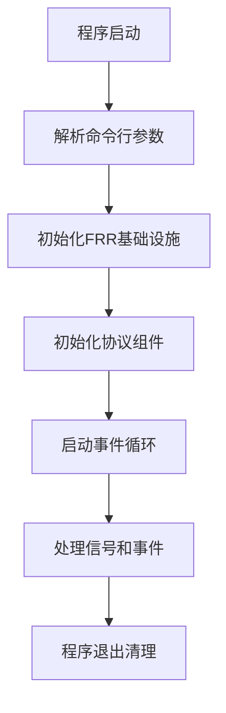
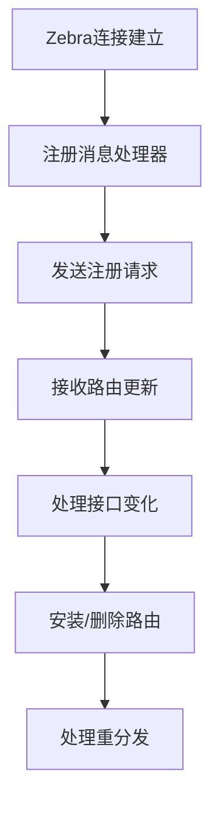
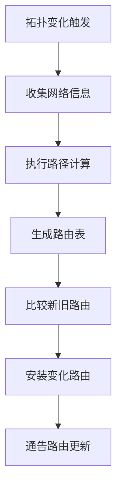
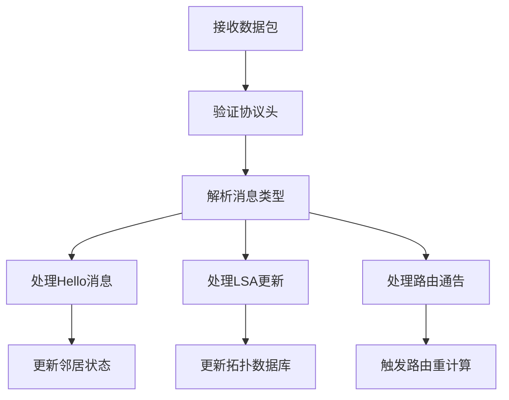
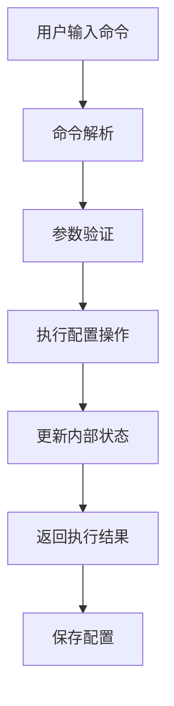
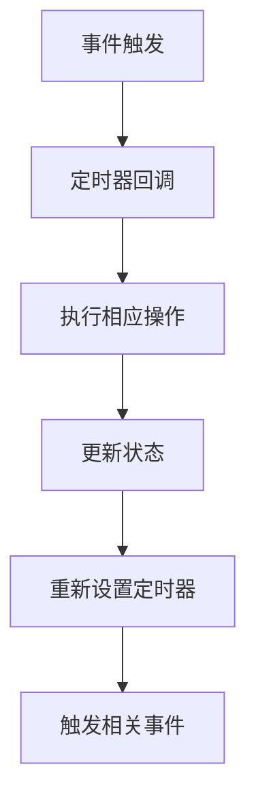

我来详细梳理每个部分的主要逻辑和实现建议：

# FRR 自定义路由协议各部分逻辑梳理与实现建议

## 1. 主程序框架 (main.c) 

### 主要逻辑


### 核心职责
1. **生命周期管理**：程序的启动、运行、退出
2. **组件初始化**：按正确顺序初始化各个模块
3. **信号处理**：优雅处理系统信号
4. **事件循环**：维护主事件循环

### 实现建议

#### 1.1 初始化顺序很关键
```c
int main(int argc, char **argv)
{
    /* 1. FRR预初始化 - 必须最先执行 */
    frr_preinit(&myprotod_di, argc, argv);
    
    /* 2. 解析命令行参数 */
    while ((opt = frr_getopt(argc, argv, NULL)) != EOF) {
        // 处理自定义参数
    }
    
    /* 3. 初始化事件循环 - 其他组件依赖此循环 */
    master = frr_init();
    
    /* 4. 初始化协议核心 - 在zebra之前 */
    myproto_init();
    
    /* 5. 初始化zebra客户端 - 需要master循环 */
    myproto_zebra_init(master);
    
    /* 6. 初始化VTY - 最后初始化用户接口 */
    myproto_vty_init();
    
    /* 7. 启动守护进程 */
    frr_config_fork();
    frr_run(master);
}
```

#### 1.2 信号处理最佳实践
```c
/* 优雅关闭处理 */
static void sigterm_handler(void)
{
    zlog_notice("Received SIGTERM, shutting down gracefully");
    
    /* 1. 停止接受新连接 */
    myproto_stop_listening();
    
    /* 2. 通知邻居协议关闭 */
    myproto_send_goodbye_messages();
    
    /* 3. 清理路由表 */
    myproto_cleanup_routes();
    
    /* 4. 关闭zebra连接 */
    zclient_stop(zclient);
    
    /* 5. 退出程序 */
    frr_fini();
    exit(0);
}

/* 配置重载处理 */
static void sighup_handler(void)
{
    zlog_info("Received SIGHUP, reloading configuration");
    
    /* 重新读取配置文件 */
    vty_read_config(NULL, myprotod_di.config_file, config_default);
    
    /* 应用新配置 */
    myproto_apply_config_changes();
}
```

#### 1.3 错误处理和恢复
```c
/* 添加错误恢复机制 */
static void setup_error_recovery(void)
{
    /* 设置内存不足处理 */
    hook_register(frr_early_fini, myproto_emergency_cleanup);
    
    /* 设置异常退出处理 */
    atexit(myproto_cleanup_on_exit);
}
```

## 2. Zebra 接口 (zebra.c)

### 主要逻辑


### 核心职责
1. **路由安装**：将计算出的路由安装到内核
2. **接口监控**：监听接口状态变化
3. **重分发处理**：处理其他协议的路由重分发
4. **连接管理**：维护与zebra的连接

### 实现建议

#### 2.1 连接管理和重连机制
```c
/* 连接状态管理 */
struct myproto_zebra {
    struct zclient *zclient;
    bool connected;
    int reconnect_attempts;
    struct event *reconnect_timer;
};

static void myproto_zebra_connected(struct zclient *zclient)
{
    struct myproto *proto = myproto_lookup();
    
    zlog_info("MyProto: Connected to Zebra");
    proto->zebra->connected = true;
    proto->zebra->reconnect_attempts = 0;
    
    /* 重新注册所有需要的消息类型 */
    zclient_send_reg_requests(zclient, VRF_DEFAULT);
    
    /* 重新安装所有路由 */
    myproto_zebra_reinstall_routes(proto);
}

static void myproto_zebra_disconnected(struct zclient *zclient)
{
    struct myproto *proto = myproto_lookup();
    
    zlog_warn("MyProto: Disconnected from Zebra");
    proto->zebra->connected = false;
    
    /* 启动重连定时器 */
    event_add_timer(master, myproto_zebra_reconnect_timer, proto,
                   ZEBRA_RECONNECT_INTERVAL, &proto->zebra->reconnect_timer);
}
```

#### 2.2 批量路由操作优化
```c
/* 批量路由安装 - 提高性能 */
void myproto_zebra_route_batch_add(struct list *route_list)
{
    struct listnode *node;
    struct myproto_route *route;
    struct zapi_route api_routes[ZEBRA_BATCH_SIZE];
    int count = 0;
    
    for (ALL_LIST_ELEMENTS_RO(route_list, node, route)) {
        /* 准备API结构 */
        myproto_prepare_zapi_route(&api_routes[count], route);
        count++;
        
        /* 达到批次大小或列表结束时发送 */
        if (count >= ZEBRA_BATCH_SIZE || 
            node->next == NULL) {
            
            zclient_route_send_batch(ZEBRA_ROUTE_ADD, zclient, 
                                   api_routes, count);
            count = 0;
        }
    }
}
```

#### 2.3 接口状态监控
```c
/* 接口状态变化处理 */
static int myproto_interface_state_change(ZAPI_CALLBACK_ARGS)
{
    struct interface *ifp;
    struct myproto_interface *iface;
    
    ifp = zebra_interface_state_read(zclient->ibuf, vrf_id);
    if (!ifp) return 0;
    
    iface = myproto_interface_lookup(ifp);
    if (!iface) return 0;
    
    if (if_is_up(ifp)) {
        zlog_info("MyProto: Interface %s is up", ifp->name);
        myproto_interface_up(iface);
    } else {
        zlog_info("MyProto: Interface %s is down", ifp->name);
        myproto_interface_down(iface);
    }
    
    return 0;
}
```

## 3. 路由算法核心 (algorithm.c)

### 主要逻辑


### 核心职责
1. **拓扑维护**：维护网络拓扑信息
2. **路径计算**：执行最短路径或其他算法
3. **路由生成**：生成最优路由表
4. **增量更新**：只处理变化的路由

### 实现建议

#### 3.1 数据结构设计
```c
/* 网络拓扑表示 */
struct myproto_topology {
    struct hash *node_table;        /* 节点哈希表 */
    struct hash *link_table;        /* 链路哈希表 */
    uint32_t sequence_number;       /* 拓扑版本号 */
    time_t last_update;            /* 最后更新时间 */
};

/* 节点信息 */
struct myproto_node {
    uint32_t node_id;              /* 节点ID */
    struct list *adjacency_list;   /* 邻接链路列表 */
    struct list *prefix_list;      /* 通告前缀列表 */
    uint32_t sequence_number;      /* 节点序列号 */
    time_t last_update;           /* 最后更新时间 */
};

/* 链路信息 */
struct myproto_link {
    uint32_t from_node;           /* 起始节点 */
    uint32_t to_node;             /* 目标节点 */
    uint32_t metric;              /* 链路开销 */
    uint8_t flags;                /* 链路标志 */
    time_t last_update;           /* 最后更新时间 */
};
```

#### 3.2 Dijkstra算法优化实现
```c
/* 优化的Dijkstra实现 */
struct myproto_spf_result *myproto_dijkstra_calculate(
    struct myproto_topology *topo, uint32_t root_id)
{
    struct fibonacci_heap *heap;    /* 使用斐波那契堆优化 */
    struct hash *distance_table;    /* 距离表 */
    struct hash *parent_table;      /* 父节点表 */
    struct myproto_spf_result *result;
    
    /* 初始化 */
    heap = fib_heap_new();
    distance_table = hash_create(node_hash_key, node_hash_cmp, NULL);
    parent_table = hash_create(node_hash_key, node_hash_cmp, NULL);
    
    /* 设置根节点距离为0 */
    myproto_set_distance(distance_table, root_id, 0);
    fib_heap_insert(heap, root_id, 0);
    
    /* 主循环 */
    while (!fib_heap_empty(heap)) {
        uint32_t current_node = fib_heap_extract_min(heap);
        uint32_t current_dist = myproto_get_distance(distance_table, current_node);
        
        /* 检查所有邻居 */
        struct myproto_node *node = myproto_node_lookup(topo, current_node);
        struct listnode *adj_node;
        struct myproto_link *link;
        
        for (ALL_LIST_ELEMENTS_RO(node->adjacency_list, adj_node, link)) {
            uint32_t neighbor = link->to_node;
            uint32_t new_dist = current_dist + link->metric;
            uint32_t old_dist = myproto_get_distance(distance_table, neighbor);
            
            /* 松弛操作 */
            if (new_dist < old_dist) {
                myproto_set_distance(distance_table, neighbor, new_dist);
                myproto_set_parent(parent_table, neighbor, current_node);
                
                if (old_dist == INFINITY) {
                    fib_heap_insert(heap, neighbor, new_dist);
                } else {
                    fib_heap_decrease_key(heap, neighbor, new_dist);
                }
            }
        }
    }
    
    /* 构建结果 */
    result = myproto_build_spf_result(distance_table, parent_table, root_id);
    
    /* 清理 */
    fib_heap_free(heap);
    hash_clean(distance_table, NULL);
    hash_clean(parent_table, NULL);
    
    return result;
}
```

#### 3.3 增量更新机制
```c
/* 增量路由更新 */
void myproto_incremental_update(struct myproto *proto,
                               struct myproto_topology_change *change)
{
    struct myproto_route_table *old_table, *new_table;
    struct list *changed_routes;
    
    /* 保存当前路由表 */
    old_table = proto->route_table;
    
    /* 应用拓扑变化 */
    myproto_apply_topology_change(proto->topology, change);
    
    /* 只重新计算受影响的部分 */
    if (change->type == LINK_FAILURE) {
        /* 链路故障：只重算经过该链路的路由 */
        new_table = myproto_recalculate_affected_routes(proto, change);
    } else if (change->type == NODE_FAILURE) {
        /* 节点故障：重算经过该节点的所有路由 */
        new_table = myproto_recalculate_node_routes(proto, change);
    } else {
        /* 其他变化：全量重算 */
        new_table = myproto_full_recalculate(proto);
    }
    
    /* 计算路由差异 */
    changed_routes = myproto_route_diff(old_table, new_table);
    
    /* 只安装变化的路由 */
    myproto_install_route_changes(proto, changed_routes);
    
    /* 更新路由表 */
    proto->route_table = new_table;
    myproto_route_table_free(old_table);
}
```

## 4. 协议消息处理 (packet.c)

### 主要逻辑


### 核心职责
1. **消息解析**：解析协议数据包
2. **邻居发现**：维护邻居关系
3. **拓扑同步**：同步网络拓扑信息
4. **可靠传输**：确保重要消息的可靠传递

### 实现建议

#### 4.1 消息处理框架
```c
/* 消息处理器注册表 */
struct myproto_msg_handler {
    uint8_t msg_type;
    int (*handler)(struct myproto_interface *iface,
                   struct sockaddr_in *from,
                   void *msg, size_t len);
    const char *name;
};

static struct myproto_msg_handler msg_handlers[] = {
    {MYPROTO_MSG_HELLO, myproto_process_hello, "Hello"},
    {MYPROTO_MSG_LSA, myproto_process_lsa, "LSA"},
    {MYPROTO_MSG_LSU, myproto_process_lsu, "LSU"},
    {MYPROTO_MSG_ACK, myproto_process_ack, "ACK"},
    {0, NULL, NULL}
};

/* 统一消息处理入口 */
static void myproto_packet_process(struct myproto_interface *iface,
                                  struct sockaddr_in *from,
                                  char *buf, int len)
{
    struct myproto_header *header;
    struct myproto_msg_handler *handler;
    
    /* 基本验证 */
    if (len < sizeof(struct myproto_header)) {
        myproto_packet_drop(iface, "Too short", len);
        return;
    }
    
    header = (struct myproto_header *)buf;
    
    /* 版本检查 */
    if (header->version != MYPROTO_VERSION) {
        myproto_packet_drop(iface, "Version mismatch", header->version);
        return;
    }
    
    /* 长度检查 */
    if (ntohs(header->length) != len) {
        myproto_packet_drop(iface, "Length mismatch", len);
        return;
    }
    
    /* 查找处理器 */
    for (handler = msg_handlers; handler->handler; handler++) {
        if (handler->msg_type == header->type) {
            if (IS_MYPROTO_DEBUG_PACKET)
                zlog_debug("MyProto: Processing %s from %pI4",
                          handler->name, &from->sin_addr);
            
            handler->handler(iface, from, buf, len);
            return;
        }
    }
    
    myproto_packet_drop(iface, "Unknown message type", header->type);
}
```

#### 4.2 可靠传输机制
```c
/* 可靠传输队列 */
struct myproto_reliable_msg {
    struct myproto_neighbor *neighbor;
    void *data;
    size_t len;
    uint32_t sequence;
    int retransmit_count;
    struct event *retransmit_timer;
    time_t first_sent;
};

/* 发送需要确认的消息 */
void myproto_send_reliable(struct myproto_neighbor *neighbor,
                          void *data, size_t len)
{
    struct myproto_reliable_msg *rmsg;
    
    rmsg = XCALLOC(MTYPE_MYPROTO_RELIABLE, sizeof(*rmsg));
    rmsg->neighbor = neighbor;
    rmsg->data = XMALLOC(MTYPE_MYPROTO_DATA, len);
    memcpy(rmsg->data, data, len);
    rmsg->len = len;
    rmsg->sequence = ++neighbor->send_sequence;
    rmsg->retransmit_count = 0;
    rmsg->first_sent = time(NULL);
    
    /* 添加序列号到消息头 */
    struct myproto_header *header = (struct myproto_header *)rmsg->data;
    header->sequence = htonl(rmsg->sequence);
    
    /* 发送消息 */
    myproto_send_packet(neighbor->iface, &neighbor->address, 
                       rmsg->data, rmsg->len);
    
    /* 添加到重传队列 */
    listnode_add(neighbor->reliable_queue, rmsg);
    
    /* 设置重传定时器 */
    event_add_timer(master, myproto_retransmit_timer, rmsg,
                   MYPROTO_RETRANSMIT_INTERVAL, &rmsg->retransmit_timer);
}

/* 处理确认消息 */
static int myproto_process_ack(struct myproto_interface *iface,
                              struct sockaddr_in *from,
                              void *msg, size_t len)
{
    struct myproto_ack *ack = (struct myproto_ack *)msg;
    struct myproto_neighbor *neighbor;
    struct listnode *node, *nnode;
    struct myproto_reliable_msg *rmsg;
    
    neighbor = myproto_neighbor_lookup(iface, &from->sin_addr);
    if (!neighbor) return -1;
    
    uint32_t ack_sequence = ntohl(ack->sequence);
    
    /* 查找并删除已确认的消息 */
    for (ALL_LIST_ELEMENTS(neighbor->reliable_queue, node, nnode, rmsg)) {
        if (rmsg->sequence == ack_sequence) {
            EVENT_OFF(rmsg->retransmit_timer);
            listnode_delete(neighbor->reliable_queue, rmsg);
            XFREE(MTYPE_MYPROTO_DATA, rmsg->data);
            XFREE(MTYPE_MYPROTO_RELIABLE, rmsg);
            break;
        }
    }
    
    return 0;
}
```

#### 4.3 邻居状态机
```c
/* 邻居状态定义 */
enum myproto_neighbor_state {
    MYPROTO_NEIGHBOR_DOWN,
    MYPROTO_NEIGHBOR_INIT,
    MYPROTO_NEIGHBOR_2WAY,
    MYPROTO_NEIGHBOR_FULL
};

/* 邻居状态转换 */
void myproto_neighbor_state_change(struct myproto_neighbor *neighbor,
                                  enum myproto_neighbor_state new_state)
{
    enum myproto_neighbor_state old_state = neighbor->state;
    
    if (old_state == new_state) return;
    
    neighbor->state = new_state;
    
    if (IS_MYPROTO_DEBUG_NEIGHBOR)
        zlog_debug("MyProto: Neighbor %pI4 state change: %s -> %s",
                  &neighbor->address,
                  myproto_neighbor_state_str(old_state),
                  myproto_neighbor_state_str(new_state));
    
    /* 状态转换处理 */
    switch (new_state) {
    case MYPROTO_NEIGHBOR_DOWN:
        myproto_neighbor_down_action(neighbor);
        break;
    case MYPROTO_NEIGHBOR_FULL:
        myproto_neighbor_full_action(neighbor);
        break;
    default:
        break;
    }
    
    /* 触发路由重计算 */
    if ((old_state == MYPROTO_NEIGHBOR_FULL) != 
        (new_state == MYPROTO_NEIGHBOR_FULL)) {
        myproto_schedule_spf(neighbor->iface->myproto);
    }
}
```

## 5. VTY 命令接口 (vty.c)

### 主要逻辑


### 核心职责
1. **配置管理**：处理用户配置命令
2. **状态显示**：显示协议运行状态
3. **调试控制**：控制调试输出
4. **配置持久化**：保存和加载配置

### 实现建议

#### 5.1 配置命令层次结构
```c
/* 配置节点定义 */
enum myproto_vty_node {
    MYPROTO_NODE = 1,           /* router myproto */
    MYPROTO_INTERFACE_NODE,     /* interface配置下的myproto */
};

/* 安装命令到不同节点 */
void myproto_vty_init(void)
{
    /* 全局配置命令 */
    install_element(CONFIG_NODE, &router_myproto_cmd);
    install_element(CONFIG_NODE, &no_router_myproto_cmd);
    
    /* 协议配置命令 */
    install_element(MYPROTO_NODE, &myproto_router_id_cmd);
    install_element(MYPROTO_NODE, &myproto_timers_cmd);
    install_element(MYPROTO_NODE, &myproto_redistribute_cmd);
    
    /* 接口配置命令 */
    install_element(INTERFACE_NODE, &ip_myproto_enable_cmd);
    install_element(INTERFACE_NODE, &ip_myproto_cost_cmd);
    install_element(INTERFACE_NODE, &ip_myproto_hello_interval_cmd);
    
    /* 显示命令 */
    install_element(VIEW_NODE, &show_ip_myproto_route_cmd);
    install_element(VIEW_NODE, &show_ip_myproto_neighbor_cmd);
    install_element(VIEW_NODE, &show_ip_myproto_topology_cmd);
    
    /* 调试命令 */
    install_element(CONFIG_NODE, &debug_myproto_all_cmd);
    install_element(CONFIG_NODE, &debug_myproto_packet_cmd);
    install_element(CONFIG_NODE, &debug_myproto_algorithm_cmd);
}
```

#### 5.2 配置验证和应用
```c
/* 带验证的配置命令 */
DEFUN(myproto_hello_interval,
      myproto_hello_interval_cmd,
      "ip myproto hello-interval (1-65535)",
      IP_STR
      "MyProto interface configuration\n"
      "Hello interval\n"
      "Seconds\n")
{
    VTY_DECLVAR_CONTEXT(interface, ifp);
    struct myproto_interface *iface;
    int interval;
    
    interval = strtol(argv[3]->arg, NULL, 10);
    
    /* 参数验证 */
    if (interval < 1 || interval > 65535) {
        vty_out(vty, "Invalid hello interval: %d\n", interval);
        return CMD_WARNING_CONFIG_FAILED;
    }
    
    /* 获取接口配置 */
    iface = myproto_interface_lookup(ifp);
    if (!iface) {
        iface = myproto_interface_create(ifp);
    }
    
    /* 应用配置 */
    if (iface->hello_interval != interval) {
        iface->hello_interval = interval;
        
        /* 重新设置定时器 */
        if (iface->hello_timer) {
            EVENT_OFF(iface->hello_timer);
            event_add_timer(master, myproto_hello_timer, iface,
                           interval, &iface->hello_timer);
        }
        
        /* 通知邻居配置变化 */
        myproto_send_hello(iface);
    }
    
    return CMD_SUCCESS;
}
```

#### 5.3 丰富的显示命令
```c
/* 详细的路由表显示 */
DEFUN(show_ip_myproto_route_detail,
      show_ip_myproto_route_detail_cmd,
      "show ip myproto route [A.B.C.D/M] [detail]",
      SHOW_STR IP_STR "MyProto\n" "Routing table\n"
      "Network prefix\n" "Detailed information\n")
{
    struct myproto *proto;
    struct prefix prefix;
    bool show_detail = false;
    bool filter_prefix = false;
    
    proto = myproto_lookup();
    if (!proto) {
        vty_out(vty, "MyProto is not running\n");
        return CMD_WARNING;
    }
    
    /* 解析参数 */
    if (argc >= 5 && argv[4]->arg) {
        if (!str2prefix(argv[4]->arg, &prefix)) {
            vty_out(vty, "Invalid prefix format\n");
            return CMD_WARNING;
        }
        filter_prefix = true;
    }
    
    if (argc >= 6 && strcmp(argv[5]->arg, "detail") == 0) {
        show_detail = true;
    }
    
    /* 显示表头 */
    if (show_detail) {
        vty_out(vty, "MyProto Routing Table (detailed)\n");
        vty_out(vty, "================================\n\n");
    } else {
        vty_out(vty, "Codes: M - MyProto, * - selected route\n\n");
        vty_out(vty, "     Network          Next Hop         Metric  Age\n");
    }
    
    /* 遍历路由表 */
    struct route_node *rn;
    struct myproto_route *route;
    
    for (rn = route_top(proto->route_table->table); rn; 
         rn = route_next(rn)) {
        
        if (!rn->info) continue;
        route = rn->info;
        
        /* 过滤特定前缀 */
        if (filter_prefix && !prefix_match(&prefix, &rn->p))
            continue;
        
        if (show_detail) {
            myproto_show_route_detail(vty, route);
        } else {
            myproto_show_route_summary(vty, route);
        }
    }
    
    return CMD_SUCCESS;
}

/* 详细路由信息显示 */
static void myproto_show_route_detail(struct vty *vty, 
                                     struct myproto_route *route)
{
    char timebuf[64];
    
    vty_out(vty, "Route: %pFX\n", &route->prefix);
    vty_out(vty, "  Next hop: %pI4\n", &route->nexthop);
    vty_out(vty, "  Interface: %s\n", 
            ifindex2ifname(route->ifindex, VRF_DEFAULT));
    vty_out(vty, "  Metric: %u\n", route->metric);
    
    strftime(timebuf, sizeof(timebuf), "%Y-%m-%d %H:%M:%S",
             localtime(&route->timestamp));
    vty_out(vty, "  Last update: %s\n", timebuf);
    
    vty_out(vty, "  Flags: %s%s%s\n",
            CHECK_FLAG(route->flags, MYPROTO_ROUTE_SELECTED) ? "Selected " : "",
            CHECK_FLAG(route->flags, MYPROTO_ROUTE_INSTALLED) ? "Installed " : "",
            CHECK_FLAG(route->flags, MYPROTO_ROUTE_CHANGED) ? "Changed " : "");
    
    vty_out(vty, "\n");
}
```

## 6. 定时器和事件管理

### 主要逻辑


### 实现建议

#### 6.1 定时器管理框架
```c
/* 定时器类型 */
enum myproto_timer_type {
    MYPROTO_TIMER_HELLO,
    MYPROTO_TIMER_SPF,
    MYPROTO_TIMER_LSA_REFRESH,
    MYPROTO_TIMER_NEIGHBOR_DEAD,
    MYPROTO_TIMER_RETRANSMIT
};

/* 定时器管理结构 */
struct myproto_timer_mgr {
    struct hash *timer_table;
    uint32_t next_timer_id;
};

/* 通用定时器设置 */
void myproto_timer_set(struct myproto_timer_mgr *mgr,
                      enum myproto_timer_type type,
                      void *context,
                      int interval_ms,
                      struct event **timer_ref)
{
    /* 取消现有定时器 */
    if (*timer_ref) {
        EVENT_OFF(*timer_ref);
    }
    
    /* 设置新定时器 */
    switch (type) {
    case MYPROTO_TIMER_HELLO:
        event_add_timer_msec(master, myproto_hello_timer_cb, 
                            context, interval_ms, timer_ref);
        break;
    case MYPROTO_TIMER_SPF:
        event_add_timer_msec(master, myproto_spf_timer_cb,
                            context, interval_ms, timer_ref);
        break;
    /* ... 其他定时器类型 */
    }
}
```

#### 6.2 自适应定时器
```c
/* 自适应SPF定时器 */
struct myproto_spf_timer {
    int min_delay;          /* 最小延迟 */
    int max_delay;          /* 最大延迟 */
    int current_delay;      /* 当前延迟 */
    int backoff_factor;     /* 退避因子 */
    time_t last_spf_time;   /* 上次SPF时间 */
    int consecutive_spfs;   /* 连续SPF次数 */
};

static void myproto_adaptive_spf_schedule(struct myproto *proto)
{
    struct myproto_spf_timer *timer = &proto->spf_timer;
    time_t now = time(NULL);
    int delay;
    
    /* 如果SPF定时器已经设置，不重复设置 */
    if (proto->spf_event) return;
    
    /* 计算延迟 */
    if (now - timer->last_spf_time < 60) {  /* 1分钟内 */
        timer->consecutive_spfs++;
        delay = MIN(timer->current_delay * timer->backoff_factor,
                   timer->max_delay);
    } else {
        timer->consecutive_spfs = 0;
        delay = timer->min_delay;
    }
    
    timer->current_delay = delay;
    
    /* 设置定时器 */
    event_add_timer_msec(master, myproto_spf_calculate_cb, proto,
                        delay, &proto->spf_event);
    
    if (IS_MYPROTO_DEBUG_SPF)
        zlog_debug("MyProto: SPF scheduled in %d ms (consecutive: %d)",
                  delay, timer->consecutive_spfs);
}
```

## 7. 性能优化建议

### 7.1 内存管理优化
```c
/* 内存池管理 */
struct myproto_memory_pool {
    void **free_list;
    size_t block_size;
    size_t pool_size;
    size_t free_count;
    void *pool_memory;
};

/* 创建内存池 */
struct myproto_memory_pool *myproto_pool_create(size_t block_size, 
                                               size_t pool_size)
{
    struct myproto_memory_pool *pool;
    
    pool = XCALLOC(MTYPE_MYPROTO_POOL, sizeof(*pool));
    pool->block_size = block_size;
    pool->pool_size = pool_size;
    pool->free_count = pool_size;
    
    /* 分配连续内存块 */
    pool->pool_memory = XCALLOC(MTYPE_MYPROTO_POOL_MEM, 
                               block_size * pool_size);
    
    /* 初始化空闲列表 */
    pool->free_list = XCALLOC(MTYPE_MYPROTO_POOL_LIST, 
                             sizeof(void*) * pool_size);
    
    for (size_t i = 0; i < pool_size; i++) {
        pool->free_list[i] = (char*)pool->pool_memory + i * block_size;
    }
    
    return pool;
}

/* 从内存池分配 */
void *myproto_pool_alloc(struct myproto_memory_pool *pool)
{
    if (pool->free_count == 0) {
        return NULL;  /* 池已满 */
    }
    
    return pool->free_list[--pool->free_count];
}

/* 释放到内存池 */
void myproto_pool_free(struct myproto_memory_pool *pool, void *ptr)
{
    if (pool->free_count < pool->pool_size) {
        pool->free_list[pool->free_count++] = ptr;
    }
}
```

### 7.2 数据结构优化
```c
/* 使用红黑树优化路由查找 */
struct myproto_route_tree {
    struct route_table *ipv4_table;
    struct route_table *ipv6_table;
    struct hash *hash_table;        /* 快速精确匹配 */
    struct skiplist *ordered_list;  /* 有序遍历 */
};

/* 优化的路由查找 */
struct myproto_route *myproto_route_lookup_optimized(
    struct myproto_route_tree *tree, struct prefix *prefix)
{
    struct myproto_route *route;
    
    /* 首先尝试哈希表精确匹配 */
    route = hash_lookup(tree->hash_table, prefix);
    if (route) return route;
    
    /* 然后使用前缀树最长匹配 */
    struct route_table *table = (prefix->family == AF_INET) ?
                               tree->ipv4_table : tree->ipv6_table;
    
    struct route_node *rn = route_node_match(table, prefix);
    if (rn && rn->info) {
        route = rn->info;
        route_unlock_node(rn);
        return route;
    }
    
    return NULL;
}
```

### 7.3 网络I/O优化
```c
/* 批量数据包处理 */
#define MYPROTO_BATCH_SIZE 32

struct myproto_packet_batch {
    struct sockaddr_in from[MYPROTO_BATCH_SIZE];
    char buffers[MYPROTO_BATCH_SIZE][MYPROTO_MAX_PACKET_SIZE];
    int lengths[MYPROTO_BATCH_SIZE];
    int count;
};

/* 批量接收数据包 */
static void myproto_recv_batch(struct myproto_interface *iface)
{
    struct myproto_packet_batch batch;
    struct mmsghdr msgs[MYPROTO_BATCH_SIZE];
    struct iovec iovecs[MYPROTO_BATCH_SIZE];
    int received;
    
    /* 准备批量接收结构 */
    for (int i = 0; i < MYPROTO_BATCH_SIZE; i++) {
        iovecs[i].iov_base = batch.buffers[i];
        iovecs[i].iov_len = MYPROTO_MAX_PACKET_SIZE;
        
        msgs[i].msg_hdr.msg_name = &batch.from[i];
        msgs[i].msg_hdr.msg_namelen = sizeof(struct sockaddr_in);
        msgs[i].msg_hdr.msg_iov = &iovecs[i];
        msgs[i].msg_hdr.msg_iovlen = 1;
        msgs[i].msg_hdr.msg_control = NULL;
        msgs[i].msg_hdr.msg_controllen = 0;
    }
    
    /* 批量接收 */
    received = recvmmsg(iface->sock, msgs, MYPROTO_BATCH_SIZE, 
                       MSG_DONTWAIT, NULL);
    
    if (received > 0) {
        /* 批量处理接收到的数据包 */
        for (int i = 0; i < received; i++) {
            batch.lengths[i] = msgs[i].msg_len;
            myproto_packet_process(iface, &batch.from[i],
                                 batch.buffers[i], batch.lengths[i]);
        }
    }
}
```

这个详细的梳理涵盖了每个模块的核心逻辑和实现建议，为您提供了完整的FRR自定义路由协议开发指南。每个部分都包含了最佳实践和性能优化建议，可以帮助您构建一个高效、可靠的路由协议实现。