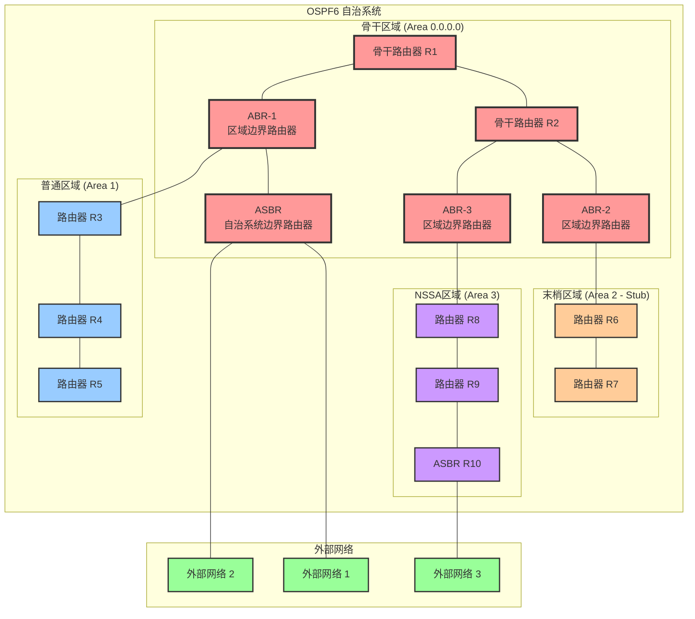
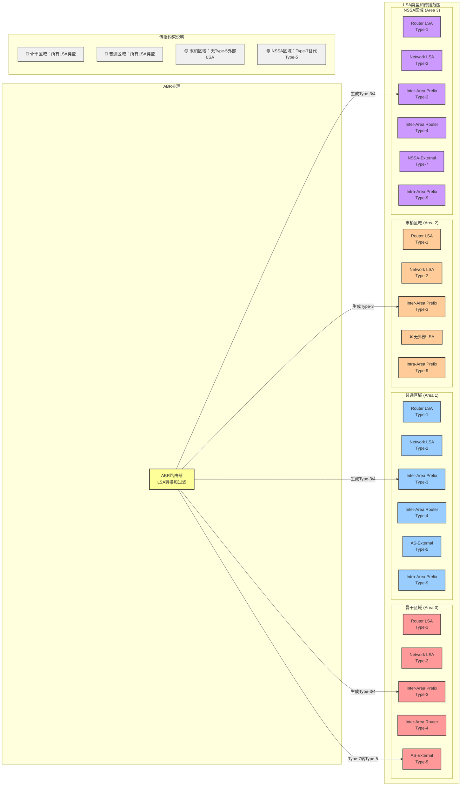
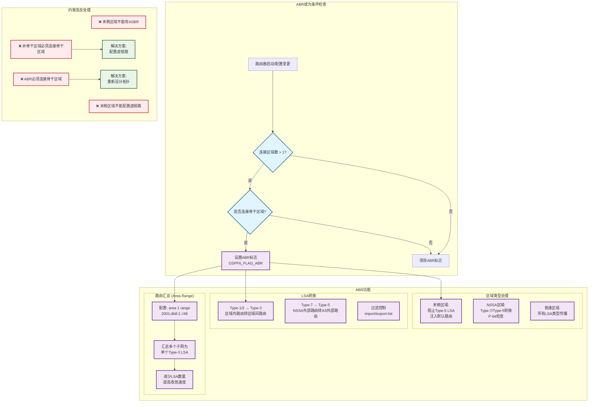

我来用图表详细解释OSPF6的区域划分约束和作用：

现在让我画一个详细的LSA传播和约束图：

最后，让我画一个ABR约束和路由汇总的详细图：

## 图解说明

### 第一个图：OSPF6 区域划分架构和约束
这个图展示了：
- **星型拓扑约束**：所有非骨干区域必须连接到骨干区域（Area 0.0.0.0）
- **不同区域类型**：普通区域、末梢区域、NSSA区域的特点
- **ABR位置**：区域边界路由器必须同时连接骨干区域和其他区域
- **ASBR限制**：末梢区域不能包含ASBR，但NSSA区域可以

### 第二个图：LSA类型和传播约束
这个图说明了：
- **LSA传播范围**：不同区域类型允许的LSA类型
- **末梢区域约束**：不允许Type-5外部LSA
- **NSSA特殊性**：使用Type-7替代Type-5，由ABR进行转换
- **ABR的LSA转换功能**：在区域间进行LSA类型转换

### 第三个图：ABR约束和路由汇总机制
这个图详细展示了：
- **ABR成为条件**：必须连接多个区域且包含骨干区域
- **路由汇总功能**：减少LSA数量，提高网络效率
- **约束违反处理**：常见配置错误和解决方案

## 关键约束总结

1. **拓扑约束**：强制星型结构，骨干区域为中心
2. **ABR约束**：必须连接骨干区域才能成为ABR
3. **区域类型约束**：不同区域类型有不同的LSA传播限制
4. **路由传播约束**：区域间通信必须通过骨干区域
5. **配置约束**：某些功能（如虚链路）不能在特定区域类型中使用

这些约束确保了OSPF6网络的层次化设计、可扩展性和稳定性。

