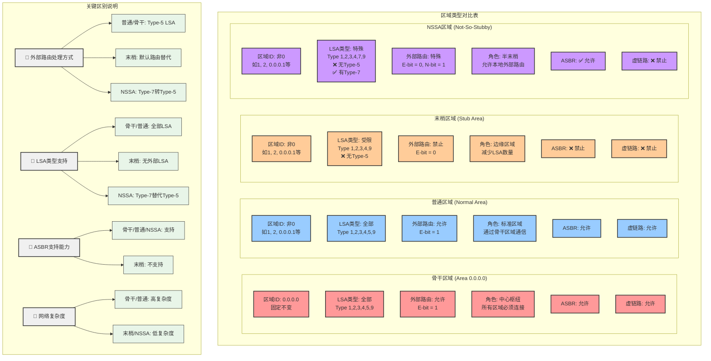

让我详细分析OSPF6中不同区域类型的核心区别：

现在让我用一个对比图来清晰展示各个区域类型的核心区别：

现在让我画一个详细的外部路由处理流程图：

## OSPF6 区域类型的核心区别总结

基于代码分析和图表展示，各区域类型的核心区别如下：

### 1. **外部路由处理方式** (最关键的区别)

````c path=ospf6d/ospf6_area.c mode=EXCERPT
if (IS_AREA_STUB(area)) {
    OSPF6_OPT_CLEAR(area->options, OSPF6_OPT_E);
    ospf6_asbr_remove_externals_from_area(area);
}
````

- **骨干/普通区域**: 完全支持Type-5外部LSA，E-bit=1
- **末梢区域**: 完全禁止外部LSA，E-bit=0，使用默认路由
- **NSSA区域**: 使用Type-7 LSA替代Type-5，E-bit=0, N-bit=1

### 2. **ASBR支持能力**

````c path=ospf6d/ospf6_area.c mode=EXCERPT
if (!ospf6_area_stub_set(ospf6, area)) {
    vty_out(vty, "First deconfigure all virtual link through this area\n");
    return CMD_WARNING_CONFIG_FAILED;
}
````

- **骨干/普通/NSSA区域**: 允许ASBR存在
- **末梢区域**: 严格禁止ASBR，配置时会检查冲突

### 3. **LSA类型支持**

````c path=ospf6d/ospf6_nssa.c mode=EXCERPT
if (IS_AREA_NSSA(area)) {
    OSPF6_OPT_CLEAR(area->options, OSPF6_OPT_E);
    OSPF6_OPT_SET(area->options, OSPF6_OPT_N);
}
````

- **骨干/普通区域**: Type-1,2,3,4,5,9 (全部)
- **末梢区域**: Type-1,2,3,4,9 (无Type-5)
- **NSSA区域**: Type-1,2,3,4,7,9 (Type-7替代Type-5)

### 4. **网络复杂度和扩展性**

- **骨干区域**: 最高复杂度，承载所有LSA类型，是网络中心
- **普通区域**: 高复杂度，功能完整但依赖骨干区域
- **末梢区域**: 最低复杂度，LSA数量最少，适合边缘网络
- **NSSA区域**: 中等复杂度，平衡了功能性和简洁性

### 5. **配置约束**

````c path=ospf6d/ospf6_area.c mode=EXCERPT
/* Disable NSSA first. */
ospf6_area_nssa_unset(ospf6, area);
SET_FLAG(area->flag, OSPF6_AREA_STUB);
````

- **互斥性**: 末梢和NSSA不能同时配置
- **虚链路**: 只有骨干和普通区域支持
- **no-summary**: 末梢和NSSA都支持，进一步减少LSA

### 6. **使用场景**

- **骨干区域**: 网络核心，必须存在，承载所有流量
- **普通区域**: 标准区域，功能完整，适合大部分场景
- **末梢区域**: 分支机构，只需访问内部和默认路由
- **NSSA区域**: 分支机构但需要重分发外部路由（如连接ISP）

### 核心设计思想

OSPF6的区域设计体现了**分层路由**的思想：
1. **骨干区域**作为信息交换中心
2. **普通区域**提供完整功能
3. **末梢区域**通过信息过滤减少复杂度
4. **NSSA区域**在简化和功能性之间找到平衡

这种设计使得网络既能保持扩展性，又能在边缘区域控制复杂度，是OSPF协议成功的关键因素之一。
