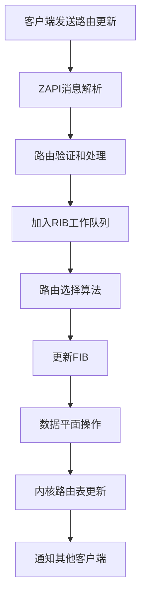
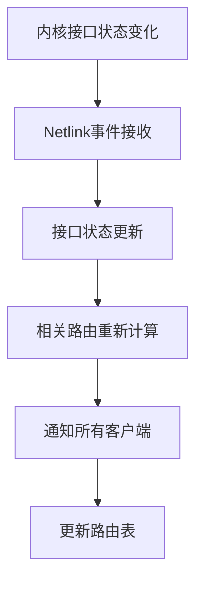

我来帮你梳理Zebra的运行逻辑。首先让我了解一下Zebra模块的整体架构和核心组件。

让我直接查看Zebra的主要文件结构：

现在让我查看Zebra的主函数，了解其启动流程：

继续查看main函数的实现：

继续查看main函数的后续部分：

现在让我查看Zebra的核心组件，首先是路由表管理：

让我查看Zebra的服务器组件：

让我查看Zebra的数据平面组件：

现在让我查看Zebra的路由处理核心函数：

现在让我查看Zebra的接口管理：

现在让我查看Zebra的客户端通信机制：

基于我对Zebra代码的分析，现在让我梳理Zebra的运行逻辑：

## Zebra运行逻辑梳理

### 1. 启动和初始化阶段

#### 1.1 主函数启动流程
````c path=zebra/main.c mode=EXCERPT
int main(int argc, char **argv)
{
    // 预初始化FRR框架
    frr_preinit(&zebra_di, argc, argv);
    
    // 初始化主事件循环
    zrouter.master = frr_init();
    
    // Zebra核心组件初始化
    zebra_router_init(asic_offload, notify_on_ack, v6_with_v4_nexthop);
    zserv_init();           // 初始化Zebra服务器
    zebra_rib_init();       // 初始化路由信息库
    zebra_if_init();        // 初始化接口管理
    zebra_debug_init();     // 初始化调试功能
    
    // 打开Zebra API服务器socket
    zserv_open(zserv_path);
    
    // 初始化网络命名空间和VRF
    zebra_ns_init();
    
    // 启动数据平面系统
    zebra_dplane_start();
    
    // 进入主事件循环
    frr_run(zrouter.master);
}
````

### 2. 核心组件架构

#### 2.1 路由信息库(RIB)管理
Zebra使用分层的路由表管理系统：

````c path=zebra/zebra_rib.c mode=EXCERPT
/* Meta Q's specific names */
enum meta_queue_indexes {
    META_QUEUE_NHG,         // 下一跳组
    META_QUEUE_EVPN,        // EVPN路由
    META_QUEUE_EARLY_ROUTE, // 高优先级路由
    META_QUEUE_EARLY_LABEL, // 高优先级标签
    META_QUEUE_CONNECTED,   // 直连路由
    META_QUEUE_KERNEL,      // 内核路由
    META_QUEUE_STATIC,      // 静态路由
    META_QUEUE_NOTBGP,      // 非BGP路由
    META_QUEUE_BGP,         // BGP路由
    META_QUEUE_OTHER,       // 其他路由
    META_QUEUE_GR_RUN,      // 优雅重启
};
````

#### 2.2 路由处理核心函数
````c path=zebra/zebra_rib.c mode=EXCERPT
/* Core function for processing routing information base. */
static void rib_process(struct route_node *rn)
{
    struct route_entry *re;
    struct route_entry *old_selected = NULL;
    struct route_entry *new_selected = NULL;
    struct route_entry *old_fib = NULL;
    struct route_entry *new_fib = NULL;
    
    // 路由选择算法
    // 1. 遍历所有路由条目
    // 2. 应用路由选择规则
    // 3. 确定最佳路由
    // 4. 更新FIB
    
    /* Update fib according to selection results */
    if (new_fib && old_fib)
        rib_process_update_fib(zvrf, rn, old_fib, new_fib);
    else if (new_fib)
        rib_process_add_fib(zvrf, rn, new_fib);
    else if (old_fib && !RIB_SYSTEM_ROUTE(old_fib))
        rib_process_del_fib(zvrf, rn, old_fib);
}
````

### 3. 数据平面架构

#### 3.1 数据平面抽象层
````c path=zebra/zebra_dplane.c mode=EXCERPT
/*
 * Zebra dataplane layer.
 * 提供硬件抽象层，支持：
 * - 路由安装/删除
 * - 下一跳组管理
 * - MPLS标签操作
 * - 接口状态管理
 * - 邻居表管理
 */
````

#### 3.2 异步处理机制
````c path=zebra/zebra_rib.c mode=EXCERPT
static void rib_process_dplane_results(struct event *thread)
{
    struct zebra_dplane_ctx *ctx;
    
    // 处理数据平面返回的结果
    while (ctx) {
        switch (dplane_ctx_get_op(ctx)) {
        case DPLANE_OP_ROUTE_INSTALL:
        case DPLANE_OP_ROUTE_UPDATE:
        case DPLANE_OP_ROUTE_DELETE:
            rib_process_result(ctx);
            break;
        case DPLANE_OP_NH_INSTALL:
        case DPLANE_OP_NH_UPDATE:
        case DPLANE_OP_NH_DELETE:
            zebra_nhg_dplane_result(ctx);
            break;
        }
    }
}
````

### 4. 客户端通信机制

#### 4.1 Zebra API服务器
````c path=zebra/zserv.c mode=EXCERPT
/*
 * Zebra API server.
 * 负责与其他FRR守护进程通信：
 * - BGP
 * - OSPF
 * - RIP
 * - ISIS
 * 等等
 */

enum zserv_event {
    ZSERV_ACCEPT,              // 接受新客户端连接
    ZSERV_PROCESS_MESSAGES,    // 处理客户端消息
    ZSERV_HANDLE_CLIENT_FAIL,  // 处理客户端失败
};
````

#### 4.2 消息处理
````c path=zebra/zapi_msg.c mode=EXCERPT
/*
 * Zebra API message creation & consumption.
 * 处理各种ZAPI消息：
 * - 路由添加/删除
 * - 接口状态更新
 * - 下一跳解析
 * - 标签分配
 */
````

### 5. 接口管理

#### 5.1 接口状态监控
````c path=zebra/interface.c mode=EXCERPT
static void if_zebra_speed_update(struct event *thread)
{
    struct interface *ifp = EVENT_ARG(thread);
    uint32_t new_speed;
    
    new_speed = kernel_get_speed(ifp, &error);
    
    if (new_speed != ifp->speed) {
        if_update_state_speed(ifp, new_speed);
        if_add_update(ifp);  // 通知客户端接口状态变化
    }
}
````

### 6. 工作队列机制

#### 6.1 多级队列处理
````c path=zebra/zebra_rib.c mode=EXCERPT
/* initialise zebra rib work queue */
static void rib_queue_init(void)
{
    zrouter.ribq = work_queue_new(zrouter.master, "route_node processing");
    
    /* fill in the work queue spec */
    zrouter.ribq->spec.workfunc = &meta_queue_process;
    zrouter.ribq->spec.max_retries = 3;
    zrouter.ribq->spec.hold = ZEBRA_RIB_PROCESS_HOLD_TIME;
    zrouter.ribq->spec.retry = ZEBRA_RIB_PROCESS_RETRY_TIME;
    
    zrouter.mq = meta_queue_new();
}
````

### 7. 运行时处理流程

#### 7.1 路由更新流程


#### 7.2 接口状态变化流程


### 8. 关键特性

#### 8.1 异步处理
- 使用事件驱动模型
- 数据平面操作异步执行
- 避免阻塞主线程

#### 8.2 优先级队列
- 不同类型路由有不同优先级
- 确保关键路由优先处理
- 支持优雅重启机制

#### 8.3 模块化设计
- 数据平面抽象
- 支持多种硬件平台
- 插件化架构

#### 8.4 高可用性
- 优雅重启支持
- 路由保持机制
- 故障恢复能力

## 总结

Zebra作为FRR的核心组件，负责：

1. **路由管理**：维护系统路由表，执行路由选择算法
2. **接口管理**：监控网络接口状态，处理接口事件
3. **客户端服务**：为其他路由协议守护进程提供API服务
4. **数据平面交互**：与底层硬件/内核进行路由安装操作
5. **事件处理**：基于事件驱动的异步处理架构

整个系统通过多级工作队列、异步处理和模块化设计，确保了高性能和高可用性的路由处理能力。
