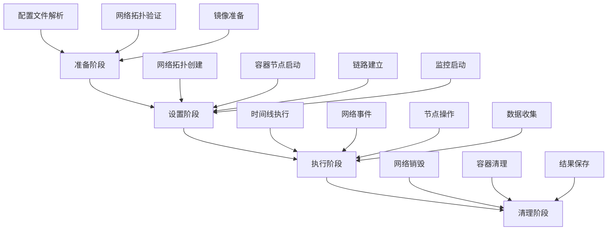

让我先查看一下您打开的文件，然后结合REALS的实验生命周期来为您详细解释。

现在让我搜索更多关于实验生命周期和可执行操作的信息：

现在让我查看更多关于监控和路由跟踪的信息：

基于我对代码库的深入分析，特别是您打开的`fib4.go`文件和整个实验生命周期，我来为您详细解释REALS的实验生命周期和可执行的操作：

## REALS实验生命周期理解

### 1. 实验生命周期的四个主要阶段



### 2. 您打开的fib4.go文件的作用

````go path=internal/exporter/fibtrace/fib4.go mode=EXCERPT
func (rtp *RouteTracePlugin) KprobeFibTableInsert() {
    // IPv4 Mode
    fn := "fib_table_insert"
    // Open a Kprobe at the entry point of the kernel function and attach the
    // pre-compiled program. Each time the kernel function enters, the program
    // will emit an event containing pid and command of the execved task.
    kp, err := link.Kprobe(fn, rtp.Objs.KprobeFibTableInsert, nil)
    if err != nil {
        rlog.Warnf("failed to opening kprobe: %s", err)
        return
    }
    defer kp.Close()
    <-rtp.ctx.Done()
}
````

**这个文件实现了路由表监控功能**：
- 使用eBPF技术监控内核路由表变化
- 跟踪IPv4路由的插入和删除操作
- 为实验提供实时的网络状态监控能力

## 可执行的操作类型

### 1. 网络事件操作

````go path=pkg/labbook/events.go mode=EXCERPT
// 网络事件类型常量定义
const (
    // 网络链路创建事件
    NetworkEventTypeLinkCreate NetworkEventType = "network-link-create"
    // 网络链路属性设置事件
    NetworkEventTypeLinkAttrSet NetworkEventType = "network-link-attr-set"
    // 网络链路销毁事件
    NetworkEventTypeLinkDestroy NetworkEventType = "network-link-destroy"
    // 网络节点创建事件
    NetworkEventTypeNodeCreate NetworkEventType = "network-node-create"
    // 网络节点销毁事件
    NetworkEventTypeNodeDestroy NetworkEventType = "network-node-destroy"
    // 网络接口创建事件
    NetworkEventTypeInterfaceCreate NetworkEventType = "network-interface-create"
    // 网络接口销毁事件
    NetworkEventTypeInterfaceDestroy NetworkEventType = "network-interface-destroy"
)
````

#### 链路操作示例

```yaml
# actions/link/change-bandwidth.json
{
  "type": "network-link-attr-set",
  "link_id": "router1-router2",
  "link_properties": {
    "mode": "up",
    "bandwidth": "100Mbps",
    "delay": "10ms",
    "loss": "0.1%"
  }
}
```

#### 动态链路创建示例

```yaml
# actions/link/create-link.json
{
  "type": "network-link-create",
  "link_id": "dynamic-link-1",
  "link_create_args": {
    "endpoints": ["node1:eth1", "node2:eth1"],
    "switch": "dynamic-switch"
  },
  "link_properties": {
    "mode": "up",
    "bandwidth": "1Gbps",
    "delay": "5ms",
    "loss": "0%"
  }
}
```

### 2. 节点操作

````go path=pkg/labbook/events.go mode=EXCERPT
// NodeExecArgs 表示节点执行命令的参数
type NodeExecArgs struct {
    Key        string   `yaml:"key,omitempty"`        // 命令唯一标识
    ShellCodes []string `yaml:"shellcodes,omitempty"` // 脚本内容
    DaemonMode bool     `yaml:"daemon,omitempty"`     // 是否后台长期运行
    OutputPath string   `yaml:"output,omitempty"`     // 输出路径
    Timeout    int      `yaml:"timeout,omitempty"`    // 超时时间(秒)
}
````

#### 节点命令执行示例

```yaml
# actions/node/start-bgp.json
{
  "node_name": "router1",
  "exec_args": {
    "key": "start-bgp-daemon",
    "shellcodes": [
      "systemctl start bird",
      "birdc configure"
    ],
    "daemon": true,
    "output": "/var/log/bgp-start.log",
    "timeout": 30
  }
}
```

#### 流量生成示例

```yaml
# actions/node/generate-traffic.json
{
  "node_name": "client1",
  "exec_args": {
    "key": "iperf3-client",
    "shellcodes": [
      "iperf3 -c 192.168.1.2 -t 60 -i 1 -J"
    ],
    "daemon": false,
    "output": "/tmp/iperf3-results.json",
    "timeout": 70
  }
}
```

### 3. 监控和数据收集操作

#### 路由监控（基于您打开的文件）

````go path=internal/exporter/fibtrace/fibtrace_exporter.go mode=EXCERPT
func (e *fibTraceExporter) Collect(ch chan<- prometheus.Metric) {
    fib4AddTotal, _ := e.routeTracePlugin.ReportFib4AddTotalCount()
    fib4DelTotal, _ := e.routeTracePlugin.ReportFib4DelTotalCount()
    fib6AddTotal, _ := e.routeTracePlugin.ReportFib6AddTotalCount()
    fib6DelTotal, _ := e.routeTracePlugin.ReportFib6DelTotalCount()

    ch <- prometheus.MustNewConstMetric(e.fib4AddTotal, prometheus.CounterValue, float64(fib4AddTotal))
    ch <- prometheus.MustNewConstMetric(e.fib4DelTotal, prometheus.CounterValue, float64(fib4DelTotal))
    ch <- prometheus.MustNewConstMetric(e.fib6AddTotal, prometheus.CounterValue, float64(fib6AddTotal))
    ch <- prometheus.MustNewConstMetric(e.fib6DelTotal, prometheus.CounterValue, float64(fib6DelTotal))
}
````

#### 监控配置示例

```yaml
# monitors/route/track-convergence.json
{
  "type": "route-monitor",
  "target_nodes": ["router1", "router2", "router3"],
  "metrics": [
    "route_count",
    "convergence_time",
    "route_flap_count"
  ],
  "output_format": "prometheus",
  "sampling_interval": "1s"
}
```

### 4. 实验时间线管理

````go path=pkg/labbook/playbook.go mode=EXCERPT
// experiment: 背景, 时间线
type TimelineItem struct {
    At          uint64  `yaml:"at"`               // 事件发生时间
    Description string  `yaml:"description"`      // 事件描述
    Action      *Action `yaml:"action,omitempty"` // 执行动作
}
````

#### 完整实验时间线示例

```yaml
# playbook.yaml
timeline:
  - at: 0
    description: "实验开始 - 启动BGP服务"
    action:
      type: "netfunc-events"
      source: "actions/node/start-bgp.json"
  
  - at: 5000  # 5秒后
    description: "注入链路故障"
    action:
      type: "network-events"
      source: "actions/link/link-down.json"
      with:
        link_id: "router1-router2"
  
  - at: 10000  # 10秒后
    description: "开始流量测试"
    action:
      type: "netfunc-events"
      source: "actions/node/start-iperf.json"
  
  - at: 30000  # 30秒后
    description: "恢复链路"
    action:
      type: "network-events"
      source: "actions/link/link-up.json"
      with:
        link_id: "router1-router2"
  
  - at: 60000  # 60秒后
    description: "收集路由表信息"
    action:
      type: "netfunc-exec-output"
      source: "queries/node/get-routes.json"
```

## 高级操作示例

### 1. 动态带宽调整实验

````go path=itools/expcases/dynbps/dynbps.go mode=EXCERPT
linkAttrSetReq := &proto.LinkEventRequest{
    NetworkId: 1,
    LinkEvents: []model.LinkEvent{
        {
            LinkId: "uA-uB",
            Type:   model.LINK_EVENT_TYPE_LINK_ATTR_SET,
            LinkAttr: &model.LinkAttr{
                Mode:      model.LINK_ATTR_MODE_UP,
                Bandwidth: uint64(THROUGHPUT_LOW),
                DelayUs:   0,
                Loss:      0,
            },
        },
    },
}
````

### 2. 路由收敛性测试

```yaml
# 路由收敛性实验配置
timeline:
  - at: 0
    description: "启动路由监控"
    action:
      type: "monitor-start"
      source: "monitors/route/convergence-monitor.json"
  
  - at: 1000
    description: "断开主链路"
    action:
      type: "network-events"
      source: "actions/link/primary-link-down.json"
  
  - at: 2000
    description: "测量收敛时间"
    action:
      type: "query"
      source: "queries/route/measure-convergence.json"
```

### 3. 网络故障注入

```yaml
# 故障注入实验
timeline:
  - at: 0
    description: "正常运行阶段"
    action:
      type: "netfunc-events"
      source: "actions/traffic/start-background-traffic.json"
  
  - at: 10000
    description: "注入丢包故障"
    action:
      type: "network-events"
      source: "actions/fault/inject-packet-loss.json"
      with:
        loss_rate: "5%"
        duration: "30s"
  
  - at: 45000
    description: "恢复正常"
    action:
      type: "network-events"
      source: "actions/fault/clear-faults.json"
```

## 监控和输出

### 1. 实时监控指标

- **路由表变化**：通过eBPF监控（如您的fib4.go文件）
- **链路状态**：带宽、延迟、丢包率
- **流量统计**：吞吐量、连接数、错误率
- **协议状态**：BGP邻居、OSPF LSA、收敛时间

### 2. 数据输出格式

```yaml
# 输出配置示例
outputs:
  - type: "prometheus"
    endpoint: "http://localhost:9090"
    metrics: ["route_count", "link_utilization"]
  
  - type: "json"
    file: "results/experiment-{timestamp}.json"
    
  - type: "pcap"
    file: "captures/traffic-{node}.pcap"
    nodes: ["router1", "router2"]
```

## 总结

REALS的实验生命周期提供了完整的网络仿真实验框架：

1. **准备阶段**：配置解析、拓扑验证
2. **设置阶段**：网络创建、容器启动、监控部署
3. **执行阶段**：时间线驱动的动态操作
4. **清理阶段**：资源回收、结果保存

**可执行的操作包括**：
- 网络拓扑动态变更
- 链路属性实时调整
- 节点命令执行
- 流量生成和测试
- 故障注入和恢复
- 实时监控和数据收集

您打开的`fib4.go`文件是监控系统的重要组成部分，它通过eBPF技术实现了对内核路由表变化的实时跟踪，为网络收敛性分析、路由协议测试等实验提供了关键的观测能力。
