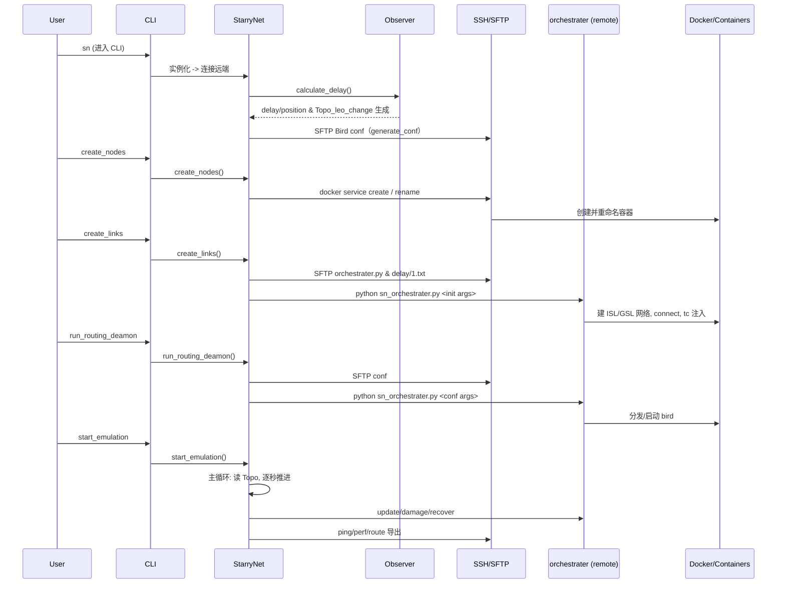

## 组件架构图
我先给一张“组件/数据流”示意图，帮助整体把握谁控制谁、数据产自哪里、在哪儿执行。

[图1] StarryNet 架构总览
- 本地：CLI/Runner → StarryNet 控制器 → Observer 计算位置/延迟并生成 Bird 配置 → 通过 SSH/SFTP 推送到远端
- 远端：sn_orchestrater.py 执行 Docker 网络编排、tc netem、Bird 路由启动/更新
- 仿真期间：按 Topo_leo_change.txt 驱动的秒级循环执行增删链路、更新时延、触发 ping/iperf/route 导出等

我用一张流程图概括如下（点击可放大）：

[渲染] 组件/数据流
- 用户 → 本地 CLI
- StarryNet 本地控制器 ←→ Observer（生成 delay/position/conf）
- StarryNet 本地控制器 ←SSH/SFTP→ 远端主机
- 远端主机执行 sn_orchestrater.py → Docker（service/networks/containers）→ 容器内 tc/bird
- 文件产物（本地）：delay、position、Topo_leo_change、Bird conf、ping/perf/route/utility

### 组件/数据流（Mermaid）
我画成一个简化版组件图：

[图会在下方渲染，加载中……]


## 典型运行序列（时序图）
下面这张时序图展示了“交互式”跑通一次仿真的主要调用链：

- create_nodes → 远端创建容器服务并重命名
- create_links → 推脚本/初始 delay，远端建 ISL/GSL 网络并连接容器接口 + tc 注入
- run_routing_deamon → 推 Bird 配置，远端分发并启动 bird
- start_emulation → 进入主循环，按 Topo 文件推进并执行各类动作
- stop_emulation → 清理

### 运行序列（Mermaid）
我把关键交互画成时序图：

[图会在下方渲染，加载中……]


## 主循环流程（核心逻辑）
主循环在 sn_utils.sn_Emulation_Start_Thread.run 中实现，驱动文件是 Observer 生成的 Topo_leo_change.txt。简化后的伪流程如下：

- 初始化
  - timeptr = 2（当前仿真秒）
  - 打开 Topo_leo_change.txt，逐行读取
- 遇到一段 “time T:”：
  - 先“追齐时间”到 T（逐秒）：
    - 每秒执行（如命中条件）：
      - 资源监测：若 timeptr ∈ utility_checking_time → 远端 vmstat → 写 utility-info_timeptr.txt
      - 周期时延更新：若 timeptr % update_interval == 0 → 推送 delay/timeptr.txt → 远端 orchestrater 批量 tc 延迟更新
      - 损伤：若 timeptr ∈ damage_time → 生成随机损伤列表、下发到远端 → orchestrater 将对应容器接口 tc 调整为 100% 丢包
      - 恢复：若 timeptr ∈ recovery_time → orchestrater 用配置中的 sat_loss 恢复接口丢包率
      - 源路由（选路干预）：若 timeptr ∈ sr_time → 对 src 注入下一跳（经 target 接口）以达 des
      - 测量：若 timeptr ∈ ping_time/ perf_time → 创建线程执行 ping/iperf，结果保存到 ping-*/perf-* 文件
      - 路由导出：若 timeptr ∈ route_time → 导出 route 到文件
    - timeptr += 1，按 1 秒节拍 sleep，若 timeptr ≥ duration 则结束
  - 处理 T 秒拓扑变化：
    - 按 “add:” 列表：逐条读取 s-f，加载 delay/T.txt，基于矩阵值在远端 orchestrater 上新建/连接 GSL 网络、重命名接口为 B<node>-eth<peer> 并 tc 注入 delay/loss/rate
    - 按 “del:” 列表：逐条删除 s-f 的网络连接并移除对应 docker 网络
  - 完成 T 秒的 add/del 后，再执行一次“每秒动作块”（同上），timeptr += 1（若超出持续时间则结束）
- 文件读完后，等待所有 ping/perf 线程收尾并退出

关键点：
- Topo_leo_change.txt 是“何时增删哪些链路”的主驱动
- delay/t.txt 是每秒延迟矩阵；遇到 update_interval 的秒点批量刷新 tc 延迟
- 损伤/恢复与选路/测量按用户通过 CLI 预设的时间数组触发
- 所有“对容器/网络的改动”均通过远端 orchestrater.py 完成（StarryNet 通过 SSH/SFTP 驱动）

如需对主循环搜索关键实现，可看 sn_utils.py 中 sn_Emulation_Start_Thread.run 函数（代码较长，此处不贴）。


## 最小可运行命令（交互式）
- 准备：在工作目录放好 config.json，并正确填写 remote_machine_IP/username/password；确保远端 Docker/镜像/容器内 bird/tc/iperf3 可用
- 启动 CLI：
  - uv run bin/sn
- 在 CLI 中执行：
  - create_nodes
  - create_links
  - run_routing_deamon
  - 可选：set_damage 0.3 30、set_recovery 50、set_next_hop 1 26 2 45、set_ping 26 27 30、set_perf 26 27 30、check_routing_table 27 15
  - start_emulation
  - stop_emulation 或 exit

注：我用 uv run 替代直接 python。若用示例脚本，也可 uv run python example.py（不过 example.py 内部也会走相同 API 流程）。


## 附：运行产物位置
- 本地：<配置目录>/<cons_name>-<轨道数>-<每轨卫星数>-<高度>-<倾角>-<链路策略>-<路由策略>/
  - delay/t.txt、position/t.txt、Topo_leo_change.txt、conf/bird-*/B<ID>.conf
  - ping-*.txt、perf-*.txt、route-*.txt、utility-info_*.txt
- 远端：家目录下同名子目录，承载 orchestrater 及运行期中间数据


## 两张图（可放大）
下面为我渲染的两张图：组件图与时序图。

### 架构总览图
（组件/数据流关系）

```mermaid
flowchart LR
    U[User] --> CLI[bin/sn + starrynet/cli.py]
    CLI --> SN[StarryNet (sn_synchronizer.py)]
    SN -- uses --> OBS[Observer (sn_observer.py)]
    OBS -- generate --> Files[(delay/position & Bird conf)]
    Files -. SFTP .-> REM[Remote Host]
    SN -- SSH/SFTP --> REM
    REM --> ORC[sn_orchestrater.py]
    ORC --> DK[Docker (service/networks)]
    DK --> C[(Containers: satellites + GS)]
    ORC -->|tc netem / bird| C
    SN -- during emulation --> ORC
    ORC -- update/damage/recover --> C
```

### 典型运行序列
（从命令到远端实际动作的调用链）


